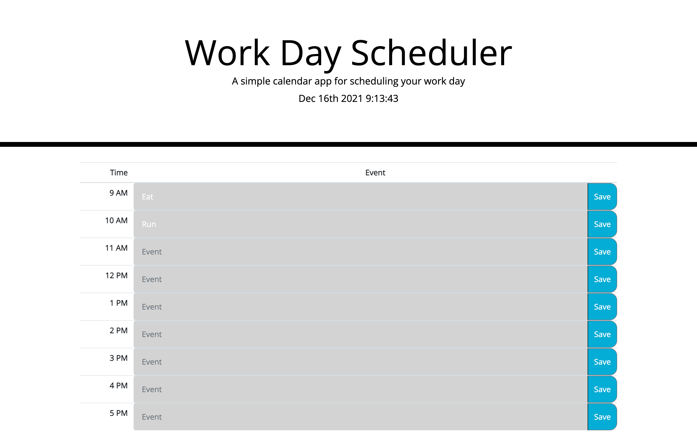

# work-day-planner
## Description
My motivation for this project is to provide support for employees who need to manage their time more efficiently. I built this project to practice using jQuery and DOM manipulation/traversal. I have also learned how to incorporate Bootstrap and utilize it in my index.HTML file. This planner presents the user with the current data and time. The user has the option to save events for each hour of a 9-5 day. Each event is color coordinated, red, gray and green, for present, past and future, respectively. The colors update every hour and the events are saved in local storage when the user presses the save button. I learned how to use jQuery and DOM traversal. I also learned how to incorporate and format moment.js to update my current dat and time every second.

## Installation
[Link to Planner](https://tinastanczyk.github.io/work-day-planner/)
## Usage

## Credits
Not Applicable
## License
[Link to License](LICENSE)
